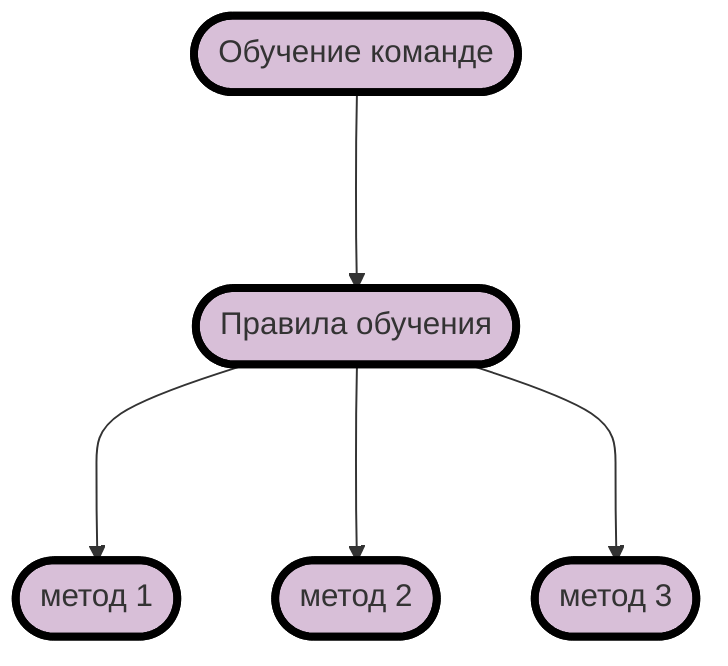

```mermaid
flowchart TD
    classDef class1 fill:#D8BFD8, stroke:#000000, stroke-width:4px
    A([Обучение команде]):::class1
    B([Правила обучения]):::class1
    A--->B
    B--->C([метод 1]):::class1 
    B--->D([метод 2]):::class1
    B--->E([метод 3]):::class1
```
